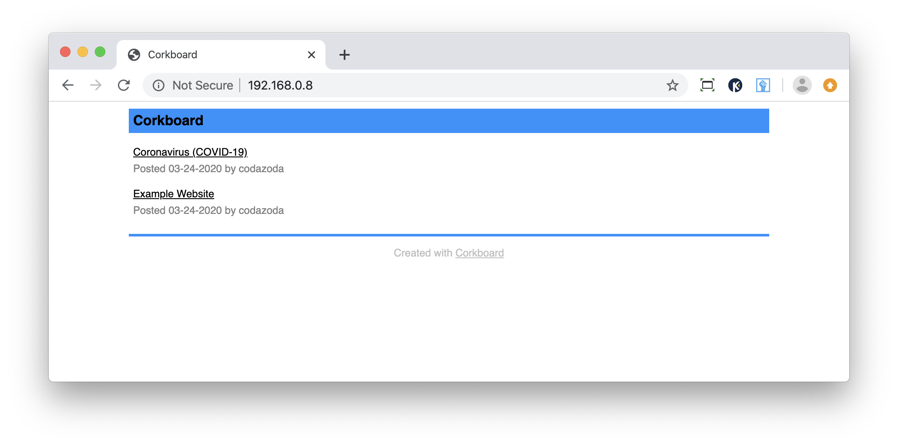

# Corkboard

Launch a simple informational site in minutes, on nearly any platform, and edit
the contents with your favorite text editor. Just unzip the files and host.



There's a [demo](https://codazoda.github.com/corkboard) hosted on GitHub,
directly from this repo.

This first version, the MVP, contains only hyperlinks to other resources.
Originally I wanted to design a Hacker News clone with user logins, submissions,
and comments, but I wanted to get the base system out now to see if anyone finds
it useful and it what ways.

Corkboard's data is stored in JSON format, a text format that can be edited
with a plain text editor.

```
[
    {
        "title": "Welcome",
        "url": "example.com",
        "date": "04-25-2020",
        "user": "codazoda"
    },
    {
        "title": "Example",
        "url": "https://www.example.com",
        "date": "04-25-2020",
        "user": "codazoda"
    }
]
```

It was designed during the Coronavirus (COVID-19) Pandemic of 2020 in response
to people needing to communicate in various ways. In Utah we had an earthquake
during the pandemic which threatened basic infrastructure such as power, water,
and internet. That shaped some of my decisions.

## Goals

* A static site that can be hosted anywhere from GitHub to a laptop
* Maintainable with nothing but a text editor
* Compact size for slow connections
* Host without internet using just a WiFi router and any computer in a pinch
* Installs itself or unzip and go

## Hosting on GitHub

You can easily host Corkboard as a static site on GitHub.

* Clone the project
* Set GitHub to host from the master branch

## Hosting with PHP

You can easily host Corkboard on a laptop by using PHP's built-in server.

Note: The PHP server is single threaded and not tested for production so you
should only use this for experimentation or in an emergency where no other
option is available to you.

* Find your IP address
* Switch to the directory containing Corkboard
* Run the PHP server `php -S {ip-address}:80`

## MIT License

Copyright (c) 2020 by Joel Dare

Permission is hereby granted, free of charge, to any person obtaining a copy
of this software and associated documentation files (the "Software"), to deal
in the Software without restriction, including without limitation the rights
to use, copy, modify, merge, publish, distribute, sublicense, and/or sell
copies of the Software, and to permit persons to whom the Software is
furnished to do so, subject to the following conditions:

The above copyright notice and this permission notice shall be included in all
copies or substantial portions of the Software.

THE SOFTWARE IS PROVIDED "AS IS", WITHOUT WARRANTY OF ANY KIND, EXPRESS OR
IMPLIED, INCLUDING BUT NOT LIMITED TO THE WARRANTIES OF MERCHANTABILITY,
FITNESS FOR A PARTICULAR PURPOSE AND NONINFRINGEMENT. IN NO EVENT SHALL THE
AUTHORS OR COPYRIGHT HOLDERS BE LIABLE FOR ANY CLAIM, DAMAGES OR OTHER
LIABILITY, WHETHER IN AN ACTION OF CONTRACT, TORT OR OTHERWISE, ARISING FROM,
OUT OF OR IN CONNECTION WITH THE SOFTWARE OR THE USE OR OTHER DEALINGS IN THE
SOFTWARE.